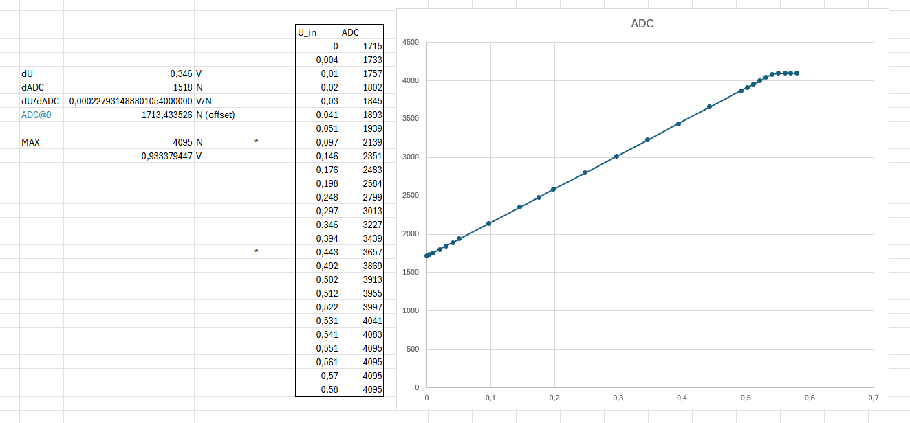
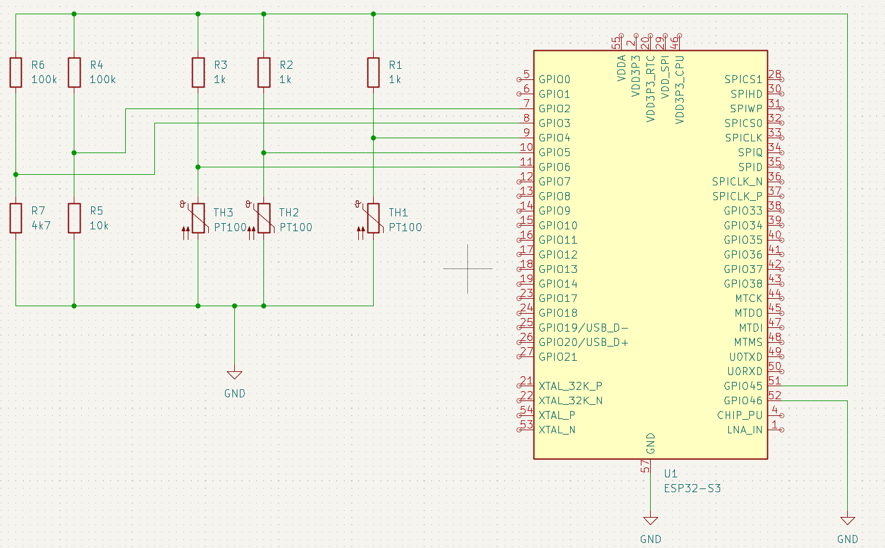
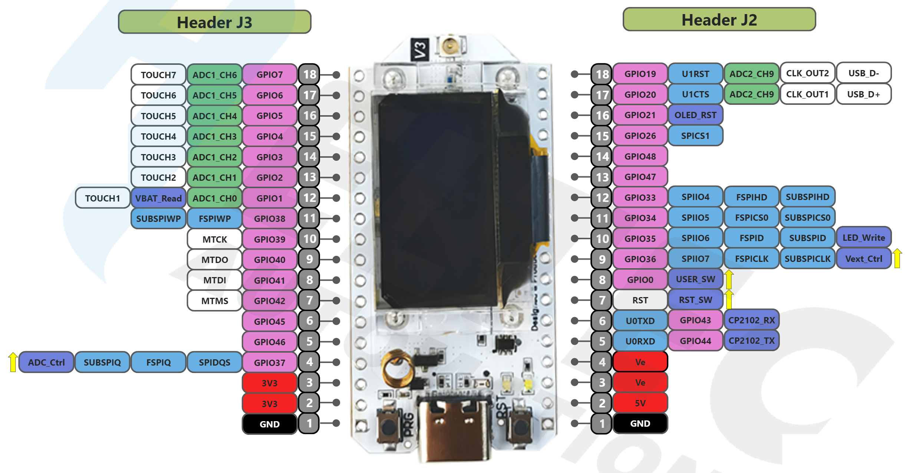

The esp32-s3 is based on the Xtensa architecture, which is not (yet) integrated into LLVM/Rust mainline.

Install the ``esp`` toolchain:

```
cargo install espup
espup install
```

Then install ``espflash``:

```
cargo install espflash
```

These steps need to be done only once, now you can build and flash the program using ``cargo run --release`` (debug is magnitudes slower than release)


## Calibration

The integrated ADC of the esp needs to be calibrated. Here are the raw measurements:



If we fix the absolutely massive offset, the ADC is good enough.

The calibration data is in ``adc_to_volt`` in [``main.rs``](./src/main.rs).

## What does it do?

It measures the temperature of the PT100 through a simple resistor voltage divider, then shows it on the connected display, and outputs it as a string (12.34) through the USB serial connection.

## Serial Output

You need to pull GPIO15 to ground to disable printing version information on boot: https://community.platformio.org/t/esp32-prevent-from-sending-serial-output-at-startup/18756/2

## Pins





